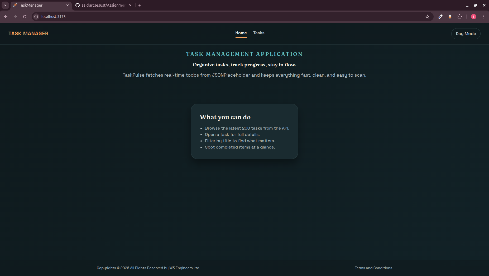
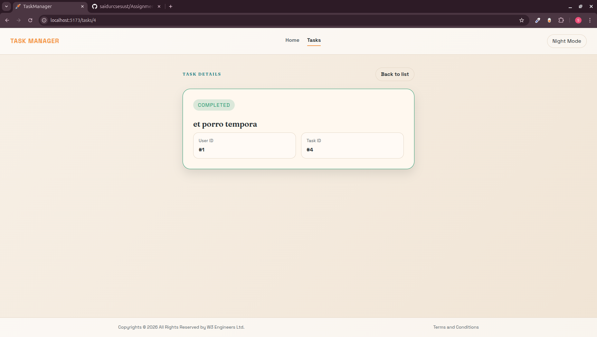

# Task List App

Task List App is a React + Vite project that pulls tasks from JSONPlaceholder,
lets users search and paginate, and stores status changes locally so they
persist across reloads.

## Features

- Task list with pagination (20 per page)
- Search by task title
- Task detail page with status and metadata
- Click "Pending" to mark a task as done
- Status changes stored in localStorage
- Loading and error states

## Tech Stack

- React 19
- React Router
- Vite
- CSS

## Screenshots

### Home Page Light Mode

### Home Page Night Mode

### TaskList Page Light Mode

### TaskList Page Night Mode

### TaskDetails Page Light Mode

### TaskDetials Page Night Mode


## Getting Started  


### Clone the repository

```bash
git clone https://github.com/saidurcsesust/Assignment_05.git
cd Assignment_05
```

1. Install dependencies

```bash
npm install
```

2. Start the dev server

```bash
npm run dev
```

3. Open the app

Vite will print the local URL in the terminal (usually
`http://localhost:5173`).

## Scripts

- `npm run dev` - Start Vite dev server
- `npm run build` - Build for production
- `npm run preview` - Preview the production build

## Data Source

Tasks are loaded from the JSONPlaceholder API:
`https://jsonplaceholder.typicode.com/todos`

Status updates are stored locally in `localStorage` under the key
`taskStatusOverrides`.
